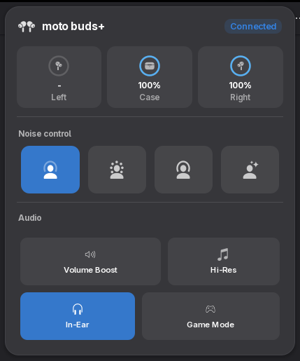
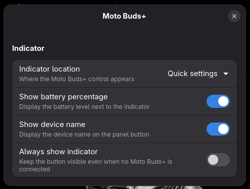
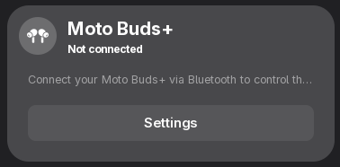

<h1 align="center">🎧 Moto Buds+ 🎧</h1>
<h4 align="center">Seamlessly connect, monitor, and control your Moto Buds+ wireless earbuds directly from the GNOME Shell desktop.</h4>

<p align="center">
    
</p>

> [!NOTE]
>
> A native GNOME Shell extension for managing Moto Buds+ wireless earbuds directly from your desktop. The extension operates entirely within the GNOME Shell environment using GJS. It continuously scans for paired Moto Buds+ devices using the system DBus and BlueZ. When the earbuds connect to your PC, the extension automatically establishes a direct low-level socket connection to the earbuds to read hardware states (battery, ANC, EQs) and send commands.

## 🌟 Features

- **Battery Monitoring** – View the real-time battery status of the left bud, right bud, and charging case directly in the panel or quick settings.
- **Active Noise Cancellation (ANC)** – Toggle between Off, Transparency, ANC, and Adaptive modes right from your desktop.
- **Audio Toggles** – Quickly toggle In-Ear Detection, Hi-Res Audio, Game Mode, and Volume Boost.
- **No Background Daemon** – Operates completely natively inside GNOME Shell using GJS without requiring separate OS-level services.

## 🏗️ Architecture & Tech Stack

**Tech Stack:** JavaScript (ES6+ / GJS), GNOME Shell / Mutter / Clutter, system BlueZ.

1. **`DeviceScanner` (`lib/scanner.js`)**: Subscribes to BlueZ DBus signals (`PropertiesChanged`, `InterfacesAdded`). It monitors the `Paired` and `Connected` states of devices matching the Moto Buds+ Service UUID. When a connection is detected, it signals the main extension to initialize the device.
2. **`MotoBudsDevice` (`lib/device.js`)**: Acts as the central state manager for the earbuds. It caches settings across connections (to ensure UI responsiveness) and translates high-level UI intents (e.g., "turn on ANC") into low-level socket commands.
3. **`MotoBudsSocket` (`lib/socket.js`)**: The networking layer. It parses and frames raw byte arrays into the proprietary binary protocol used by Moto Buds+, handling checksums (CRC32), message framing (`HEAD`/`TAIL`), and sequential queries.
4. **`ProfileManager` (`lib/profileManager.js`)**: Registers a custom Bluetooth Profile (`org.bluez.Profile1`) with BlueZ via DBus to acquire a raw file descriptor (FD) to the earbuds.
5. **UI Layer (`lib/ui/`)**: Native GNOME Shell UI components (`St.Widget`, `Clutter.Actor`) that bind directly to the `MotoBudsDevice` state. It includes a Panel indicator, a Quick Settings toggle, and a rich popup menu.

### Backend Socket Implementation

There is no separate background daemon or OS-level backend process. The entire "backend" is self-contained within the extension's JS runtime:

- **Profile Registration**: The extension registers a custom Bluetooth profile over DBus with BlueZ. When BlueZ establishes an RFCOMM/L2CAP connection with the earbuds, it passes a raw UNIX File Descriptor (`fd`) directly to the extension.
- **Socket I/O**: `Gio.Socket` wraps this file descriptor, allowing asynchronous, non-blocking byte reads and writes (`read_bytes_async`, `write_all_async`) directly on the GNOME Shell main loop.
- **Binary Protocol**: Packets are framed with a 4-byte header (`HEAD`), a 2-byte length, the payload, a 4-byte CRC32 checksum, and a 4-byte tail (`TAIL`). The socket class handles queuing and reassembly of fragmented Bluetooth packets natively.

---

## 📷 Screenshots

|                                                            |                                                               |
| :--------------------------------------------------------: | :-----------------------------------------------------------: |
|  |             |
|                _Quick Settings Integration_                |                       _Device Controls_                       |
|           |  |
|                        Preferences_                        |                          _Fallback_                           |

---

## 💻 Contributing

> [!TIP]  
> We welcome contributions to improve **Moto Buds+**! If you have suggestions, bug fixes, or new feature ideas, follow these steps:

1. **Fork the Repository**  
   Click the **Fork** button at the top-right of the repo page.

2. **Clone Your Fork**  
   Clone the repo locally:

   ```bash
   git clone https://github.com/ArnavK-09/moto-buds-plus-gnome-extension.git
   ```

3. **Create a Branch**  
   Create a new branch for your changes:

   ```bash
   git checkout -b your-feature-branch
   ```

4. **Make Changes**  
   Implement your changes (bug fixes, features, etc.).

5. **Commit and Push**  
   Commit your changes and push the branch:

   ```bash
   git commit -m "feat(scope): description"
   git push origin your-feature-branch
   ```

6. **Open a Pull Request**  
   Open a PR with a detailed description of your changes.

7. **Collaborate and Merge**  
   The maintainers will review your PR, request changes if needed, and merge it once approved.

## 🙋‍♂️ Issues

Found a bug or need help? Please create an issue on the [GitHub repository](https://github.com/ArnavK-09/moto-buds-plus-gnome-extension/issues) with a detailed description.

## 👤 Author

<table>
  <tbody>
    <tr>
        <td align="center" valign="top" width="14.28%"><a href="https://github.com/ArnavK-09"></a><br /><a href="https://github.com/ArnavK-09"<h4><b>Arnav K</b></h3></a></td>
    </tr>
  </tbody>
</table>

---

## 🪉Acknowledgements

- `maniacx/BudsLink`

<h2 align="center">📄 License</h2>

<p align="center">
<strong>Moto Buds+</strong> is licensed under the <code>Unlicense</code> License. See the <a href="https://github.com/ArnavK-09/moto-buds-plus-gnome-extension/blob/main/LICENSE">LICENSE</a> file for more details.
</p>

---

<p align="center">
    <strong>🌟 If you find this project helpful, please give it a star on GitHub! 🌟</strong>
</p>
